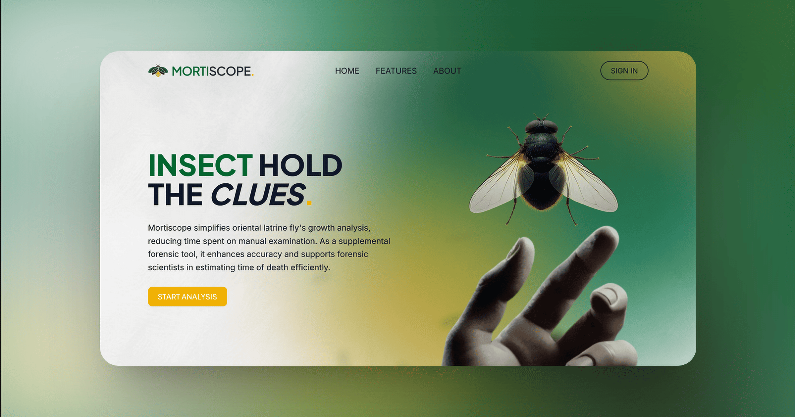

   
  
    
  

    
    
    
    
    
    
    
    
    
    
    
    
    
    
    
    
    
    
    
    
    
    
    
    
    
    
    
    
    
  

 

**Mortiscope Web** is the full-stack web application that powers the Mortiscope Post-Mortem Interval (PMI) estimation system. It is a tool for estimating how long a person has been deceased by analyzing the developmental stage of _Chrysomya megacephala_ specimens found at a scene. It integrates with the [Mortiscope API](https://github.com/mortiscope/mortiscope-api) inference engine, which handles the underlying object detection and PMI computation.

The application covers the entire case workflow which consists of structured case creation with collection metadata and image ingestion, asynchronous AI-driven analysis, interactive result visualization with manual annotation editing and recalculation, cross-case dashboard analytics, multi-format export, and a full account system with multi-provider authentication and session management.
