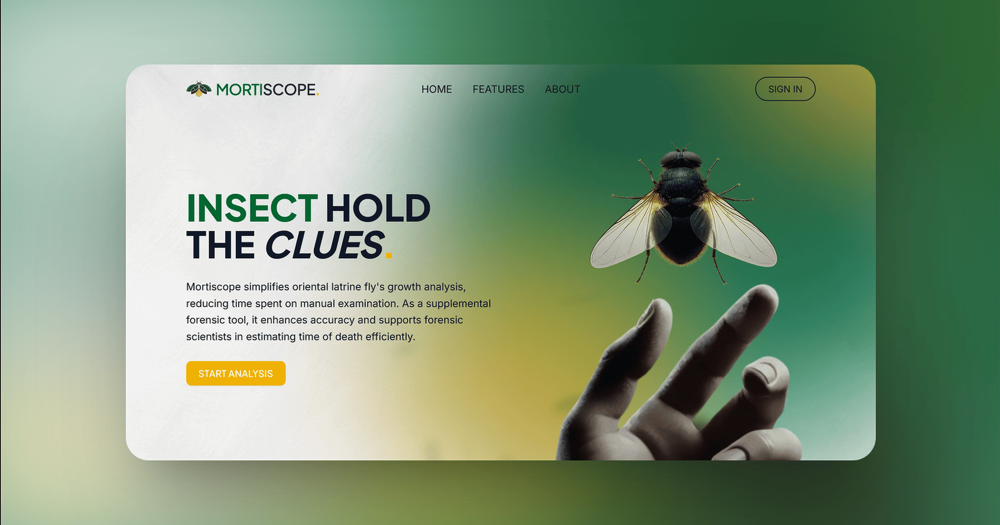

<div align="center">
  <br />
  
  <br /><br />
  <div>
    
    
    
    
    
    
    
    
    
    
    
    
    
    
    
    
    
    
    
    
    
    
    
    
    
    
    
    
    
  </div>
</div>
<br />

**Mortiscope Web** is the full-stack web application that powers the Mortiscope Post-Mortem Interval (PMI) estimation system. It is a tool for estimating how long a person has been deceased by analyzing the developmental stage of _Chrysomya megacephala_ specimens found at a scene. It integrates with the [Mortiscope API](https://github.com/mortiscope/mortiscope-api) inference engine, which handles the underlying object detection and PMI computation.

The application covers the entire case workflow which consists of structured case creation with collection metadata and image ingestion, asynchronous AI-driven analysis, interactive result visualization with manual annotation editing and recalculation, cross-case dashboard analytics, multi-format export, and a full account system with multi-provider authentication and session management.

## 🚀 Getting Started

This guide provides multiple approaches to set up and run the Mortiscope Web application for local development and testing.

### 📋 Prerequisites

Before beginning, ensure the following are installed and configured:

- **[Node.js 20.0+](https://nodejs.org/)** — The JavaScript runtime for the application. A **[Long-Term Support LTS](https://nodejs.org/en/about/previous-releases)** version is recommended for stability.
- **[pnpm 10.0+](https://pnpm.io/)** — Fast, disk space efficient package manager. Recommended for this project and required by the lockfile. Install globally via `npm install -g pnpm` or `corepack enable pnpm`.
- **[Git](https://git-scm.com/downloads)** — Distributed version control system needed to clone the repository and manage code changes.
- **[PostgreSQL](https://www.postgresql.org/)** — Primary relational database for storing case data, detections, analyses, and exports. Version 16+ recommended.
- **[AWS S3](https://aws.amazon.com/s3/)** — Cloud object storage for images and export artifacts. Requires an active AWS account, an S3 bucket, and IAM credentials with read/write permissions.
- **[Upstash Redis](https://upstash.com/)** — Serverless Redis database for rate limiting and session management. Create a free account and database at [upstash.com](https://upstash.com/).
- **[Resend](https://resend.com/)** — Email API for transactional emails including account verification, password reset, and two-factor authentication codes. Requires a Resend account and API key.
- **[Docker](https://www.docker.com/)** (Optional) — Container platform for running the application and database in isolated environments. Required only if using the Docker deployment method.
- **[Make](https://www.gnu.org/software/make/)** (Optional) — Build automation tool. Pre-installed on macOS/Linux. Windows users can install via [Chocolatey](https://chocolatey.org/) (`choco install make`) or use the commands directly.
- **[Mortiscope API](https://github.com/mortiscope/mortiscope-api)** — The FastAPI inference engine that handles object detection and PMI computation. Must be running and accessible for the analysis pipeline to function.

### 📥 Clone Repository

Clone the repository to the local machine:

```bash
git clone https://github.com/mortiscope/mortiscope-web.git
cd mortiscope-web
```

### 🔐 Environment Configuration

The application requires environment variables for database connection, authentication, AWS services, email delivery, and external API integrations.

1. Copy the example environment file:

```bash
cp .env.example .env
```

2. Edit `.env` and configure the following variables:

**Authentication Configuration:**

- `AUTH_SECRET` — Secret key for Auth.js session signing (generate with `openssl rand -base64 32`)
- `AUTH_TRUST_HOST` — Set to `true` in production behind a proxy

**OAuth Provider Configuration (Optional):**

- `GOOGLE_CLIENT_ID` — Google OAuth 2.0 Client ID
- `GOOGLE_CLIENT_SECRET` — Google OAuth 2.0 Client Secret
- `ORCID_CLIENT_ID` — ORCID OAuth Client ID
- `ORCID_CLIENT_SECRET` — ORCID OAuth Client Secret
- `AUTH_MICROSOFT_ENTRA_ID_ID` — Microsoft Entra ID Application Client ID
- `AUTH_MICROSOFT_ENTRA_ID_SECRET` — Microsoft Entra ID Client Secret
- `AUTH_MICROSOFT_ENTRA_ID_TENANT_ID` — Microsoft Entra ID Tenant ID

**Email Configuration:**

- `RESEND_API_KEY` — Resend API key for sending transactional emails
- `RESEND_MAIL_DOMAIN` — Verified domain for sending emails

**AWS S3 Configuration:**

- `AWS_BUCKET_NAME` — S3 bucket name
- `AWS_BUCKET_REGION` — S3 bucket region
- `AWS_ACCESS_KEY_ID` — IAM access key with S3 permissions
- `AWS_SECRET_ACCESS_KEY` — IAM secret key

**Redis Configuration:**

- `UPSTASH_REDIS_REST_URL` — Upstash Redis REST API URL
- `UPSTASH_REDIS_REST_TOKEN` — Upstash Redis REST API token

**Inngest Configuration:**

- `INNGEST_EVENT_KEY` — Secret key for Inngest event authentication
- `INNGEST_SIGNING_KEY` — Secret key for Inngest request signature verification

**Application Configuration:**

- `NEXT_PUBLIC_APP_URL` — The canonical base URL of the application
- `NEXT_PUBLIC_CONTACT_EMAIL` — Default contact email address for the application
- `NEXT_PUBLIC_FASTAPI_URL` — The base URL of the Mortiscope API inference engine

**Security Configuration:**

- `FASTAPI_SECRET_KEY` — Secret key for authenticating with the FastAPI backend
- `CRON_SECRET` — Secret token for authorizing cron job endpoints
- `ENCRYPTION_KEY` — Secret key for encrypting sensitive data (generate with `openssl rand -hex 32`)

**Optional Configuration:**

- `MAXMIND_LICENSE_KEY` — MaxMind GeoLite2 license key for IP geolocation
- `SENTRY_AUTH_TOKEN` — Sentry authentication token for error tracking and performance monitoring
- `NEXT_PUBLIC_SENTRY_DSN` — Sentry Data Source Name for client-side error tracking
- `LOG_LEVEL` — Logging level (`debug`, `info`, `warn`, `error`).

> [!TIP]
> Generate secure random keys using OpenSSL: `openssl rand -base64 32` or `openssl rand -hex 32`

### 📦 Installation

> [!TIP]
> **pnpm** is the recommended package manager and provides the optimal development experience with faster installs and strict dependency management. If pnpm is unavailable, npm or Yarn can be used as alternatives.

Select one of the following installation methods.

#### 📦 Using pnpm

pnpm is the recommended package manager for this project. It handles dependency installation with better performance and disk efficiency.

1. Install all dependencies:

   ```bash
   pnpm install
   ```

2. The installation will automatically set up Husky pre-commit hooks via the `prepare` script.

#### 💾 Using npm or Yarn

> [!NOTE]
> This path skips pnpm. The `pnpm-lock.yaml` lockfile will be ignored, which may result in slightly different dependency versions. Makefile commands assume pnpm and may not work correctly.

1. Install with npm:

   ```bash
   npm install
   ```

   Or with Yarn:

   ```bash
   yarn install
   ```

2. Run the server directly:

   ```bash
   npm run dev
   # or
   yarn dev
   ```

#### 🛠️ Using Makefile

The project includes a [`Makefile`](Makefile) with convenient shortcuts for common development tasks.

1. View all available commands:

   ```bash
   make help
   ```

2. Install dependencies (runs `pnpm install`):

   ```bash
   make install
   ```

> [!NOTE]
> All Makefile commands use pnpm internally. Ensure pnpm is installed before using Makefile shortcuts.

#### 🐳 Using Docker

Docker provides a fully containerized environment with all dependencies pre-configured.

1. Ensure Docker Engine and Docker Compose are installed and running.

2. Build and start all services:

   ```bash
   docker compose up --build -d
   ```

   This starts:
   - Next.js web application on `http://localhost:3000`
   - Inngest dev server on `http://localhost:8288`
   - PostgreSQL database on port `5432`

3. View logs:

   ```bash
   docker compose logs -f
   ```

   Or via Makefile:

   ```bash
   make docker-logs
   ```

### 🖥️ Running the Application

#### 💻 Local Development

Run the Next.js application with hot-reloading enabled for development:

```bash
pnpm run dev:web
```

This command starts both:

- Next.js dev server with Turbo on `http://localhost:3000`
- Inngest dev server on `http://localhost:8288`

For Webpack-based development (without Turbo):

```bash
pnpm run dev:webpack
```

Access the application at:

- Web Application: `http://localhost:3000`
- Inngest Dashboard: `http://localhost:8288`

#### ⚡ Via Makefile

Start the development server with a single command:

```bash
make dev
```

This automatically runs `pnpm run dev:web` with both Next.js and Inngest.

#### 🐳 Via Docker Compose

With Docker Compose, the server starts automatically upon running:

```bash
make docker-up
```

Or directly:

```bash
docker compose up -d
```

Stop the services:

```bash
make docker-down
```

Access container shell for debugging:

```bash
make docker-shell
```

### 🧪 Development Tools

> [!WARNING]
> This section assumes all dependencies are installed. Run `pnpm install` first. For **npm/yarn** installations without Makefile, use the direct npm script equivalents from [`package.json`](package.json).

#### 🔍 Linting and Type Checking

The project uses **ESLint** for code linting and **TypeScript** for static type checking.

- Run linter with strict rules (fails on warnings):

  ```bash
  pnpm run lint:strict
  ```

  Or via Makefile:

  ```bash
  make lint
  ```

- Auto-fix linting issues:

  ```bash
  pnpm run lint:fix
  ```

  Or via Makefile:

  ```bash
  make lint-fix
  ```

- Run TypeScript type checking:

  ```bash
  pnpm run typecheck
  ```

  Or via Makefile:

  ```bash
  make typecheck
  ```

- Run both linting and type checking:

  ```bash
  pnpm run quality
  ```

  Or via Makefile:

  ```bash
  make quality
  ```

#### 🧬 Testing

The project includes unit tests, integration tests, and end-to-end tests with coverage reporting.

**Unit Tests (Vitest):**

- Run unit tests:

  ```bash
  pnpm run test:unit
  ```

  Or via Makefile:

  ```bash
  make test-unit
  ```

- Run unit tests with coverage:

  ```bash
  pnpm run test:unit:coverage
  ```

  Or via Makefile:

  ```bash
  make test-unit-cov
  ```

- Run unit tests with UI:

  ```bash
  pnpm run test:unit:ui
  ```

  Or via Makefile:

  ```bash
  make test-unit-ui
  ```

**Integration Tests (Vitest):**

- Run integration tests:

  ```bash
  pnpm run test:integration
  ```

  Or via Makefile:

  ```bash
  make test-integration
  ```

- Run integration tests with coverage:

  ```bash
  pnpm run test:integration:coverage
  ```

  Or via Makefile:

  ```bash
  make test-integration-cov
  ```

- Run integration tests in watch mode:

  ```bash
  pnpm run test:integration:watch
  ```

  Or via Makefile:

  ```bash
  make test-integration-watch
  ```

**End-to-End Tests (Playwright):**

- Run E2E tests in headless mode:

  ```bash
  pnpm run test:e2e
  ```

  Or via Makefile:

  ```bash
  make test-e2e
  ```

- Run E2E tests with Playwright UI:

  ```bash
  pnpm run test:e2e:ui
  ```

  Or via Makefile:

  ```bash
  make test-e2e-ui
  ```

- Run E2E tests in headed mode (visible browser):

  ```bash
  pnpm run test:e2e:headed
  ```

  Or via Makefile:

  ```bash
  make test-e2e-headed
  ```

- View last E2E test report:

  ```bash
  pnpm run test:e2e:report
  ```

  Or via Makefile:

  ```bash
  make test-e2e-report
  ```

#### 🪝 Pre-commit Hooks

Pre-commit hooks automatically run linters and formatters before each Git commit using Husky and lint-staged.

- Pre-commit hooks are automatically installed during `pnpm install` via the `prepare` script.

- To manually trigger the pre-commit hook:

  ```bash
  pnpm run pre-commit
  ```

### 🧹 Cleanup

- Remove all cache, build artifacts, and dependencies:

  ```bash
  pnpm run clean:all
  ```

  Or via Makefile:

  ```bash
  make clean-all
  ```

- Remove build artifacts only:

  ```bash
  pnpm run clean:build
  ```

  Or via Makefile:

  ```bash
  make clean-build
  ```

- Remove `node_modules` only:

  ```bash
  pnpm run clean:deps
  ```

  Or via Makefile:

  ```bash
  make clean-deps
  ```

- Remove all Docker containers, volumes, and images:

  ```bash
  make docker-clean
  ```

---

## ✨ Features

> [!NOTE]
> This list provides only a rough overview of the system's features. The internal architecture encompasses complex asynchronous pipelines, granular state management, and strict access controls that operate far beneath the surface of these high-level descriptions.

### 🧐 Analyze

- **Multi-Step Case Creation Wizard**: A guided three-step workflow for creating forensic cases, with automatic draft persistence to `localStorage` and database-backed state recovery on page reload.
- **Case Details Form**: Users provide case metadata including case name, collection date and time, ambient temperature, and a hierarchical Philippine address through cascading dropdown selectors.
- **Automatic Weather Integration**: An optional toggle fetches the historical ambient temperature from the **Open-Meteo** archive API based on the selected case date and city, using geocoding to determine coordinates and nearest-hour matching for precision. The temperature auto-resets when the date or location changes while the toggle is active.
- **Dual Image Ingestion**: Supports both **file upload** via drag-and-drop or click-to-browse and **live camera capture** with selectable aspect ratios like Square 1:1, Landscape 16:9, and Portrait 9:16, alongside front/back camera switching and mirror/flip controls. Up to **20 images** can be provided per case, each with a maximum size of **10 MB**.
- **Supported Formats**: Accepts **JPEG**, **PNG**, **WebP**, **HEIC**, and **HEIF** image formats with binary content validation via `file-type` to detect corrupted or spoofed files, alongside MIME type checking and duplicate name rejection.
- **Client-Side Image Processing**: Uploaded images support **rotation** for 0°, 90°, 180°, and 270° via offscreen canvas processing, **renaming**, **deletion**, and **preview** in both list and grid view modes with search and sort functionality. Upload progress is tracked per file with retry support for failed uploads.
- **End-to-End Image Encryption**: All uploaded images are encrypted at rest with **AES-256 Server-Side Encryption SSE-S3** in AWS S3. Images are served exclusively through authenticated proxy routes and presigned upload URLs expire after **10 minutes**. Each S3 object stores user and case metadata for ownership verification to ensure images are accessible only to the account that uploaded them.
- **Review and Submit**: Before submission, users review a sorted image summary grid and case details summary with pre-submit Zod schema re-validation. All files must have a successful upload status and at least one image is required.
- **Asynchronous AI Analysis Pipeline**: Upon submission, an **Inngest** background event triggers the FastAPI inference engine for object detection and PMI computation with up to **3 retries**, **exponential backoff**, and a **30-minute timeout**. The case transitions through `pending` to `processing` to `completed` or `failed` statuses, with a 1-minute initial delay to allow browser uploads to finalize.
- **Real-Time Status Polling**: The client polls analysis status every **3 seconds** with contextual status messages, automatic toast notifications on completion or failure, and a redirect to the results page upon successful analysis.
- **Cancellation Support**: Users can cancel an in-progress analysis, which atomically reverts the case to draft status, deletes all detection data, removes the analysis results record, and restores the wizard to the review step.

<details>
  <summary><strong>See preview</strong></summary>
  <br />
  <video src="public/demos/analyze.mp4" controls width="100%">
    Your browser does not support the video tag.
  </video>
</details>
